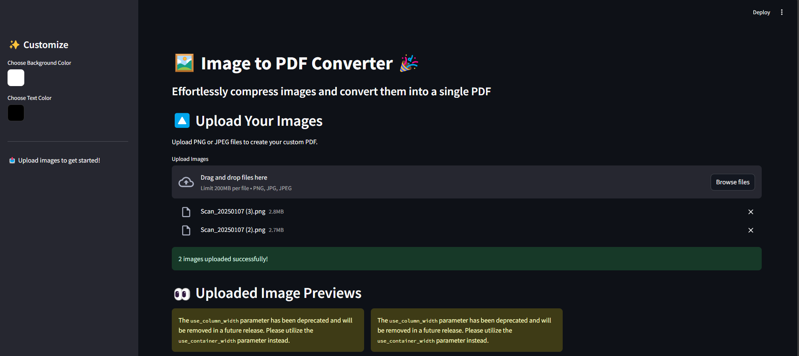

### 🌈 Image to PDF Converter 

📄 Effortlessly compress images and convert them into a single PDF with a modern and customizable interface!

### 🚀 Features
Image Compression :
Automatically compresses uploaded PNG and JPEG images while maintaining quality.
Customizable UI :
Choose background and text colors using the sidebar.
Easy-to-navigate and responsive interface.
PDF Conversion :
Converts your images into a single PDF document with one click.
Image Previews :
See previews of your uploaded images directly in the app.
File Download :
Generate and download your PDF instantly.
Drag-and-Drop :
Convenient functionality to quickly upload your images.
🛠️ Installation Instructions
### 1. Clone the Repository:
Clone this repository to your local machine:

bash
Save
Copy
1
2
git clone https://github.com/chetanmundhe2911/image-to-pdf-converter.git
cd image-to-pdf-converter

### 2. Install Required Libraries:
Run the following command to install the necessary Python packages:

bash
Save
Copy
1
pip install -r requirements.txt
Note : The required packages include streamlit, Pillow, and fpdf. 

### ▶️ Usage
Running the App:
Inside the project folder, run the Streamlit app:
bash
Copy
1
streamlit run app.py
Open the URL shown in your terminal (e.g., http://localhost:8501) to access the app.

Uploading Images:
Drag and drop PNG/JPEG images or use the Browse files button.
Optionally, customize the background and text colors using the Sidebar .

Generating a PDF:
Click the Convert to PDF button after uploading your images.

Download the generated PDF directly using the Download PDF button.
### 🖼️ Screenshot of the Interface
Interface Screenshot

### 💡 Key Benefits
Compress large images to create optimized PDFs.
User-friendly application designed for everyone.
No need for external tools or software installations.

### 🙌 Contributing
We welcome contributions from the community to help improve this project! Feel free to open an issue or create a pull request.

### 📂 Project Structure

  plaintext
  Save
  Copy
  1
  2
  3
  4
  5
  6
  7
  image-to-pdf-converter/
  │
  ├── app.py                     # Main Streamlit app file
  ├── requirements.txt           # Dependencies
  ├── README.md                  # Project documentation (this file)
  ├── temp/                      # Temporary storage for uploaded images (auto-cleaned)
  └── interface_screenshot.png   # UI screenshot for the README

### 📄 License
This project is licensed under the MIT License .

### ⭐ Acknowledgments
Thanks to the open-source community for the tools and resources that make projects like this possible!
